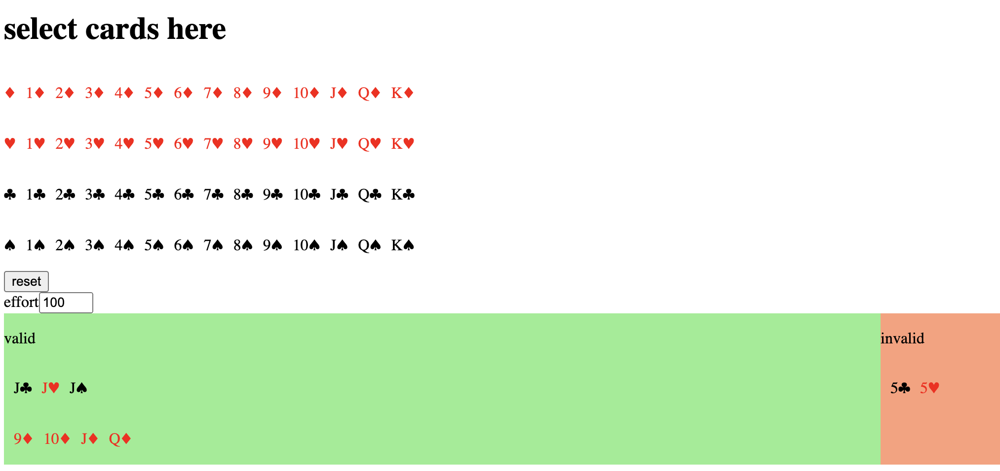

Helps you cheat in rummy (the version I know)

available in rummay.com

1. add cards to try and find series
2. increase effort to try harder (increases cpu usage and response time)
3. click on cards to remove them from selected cards

